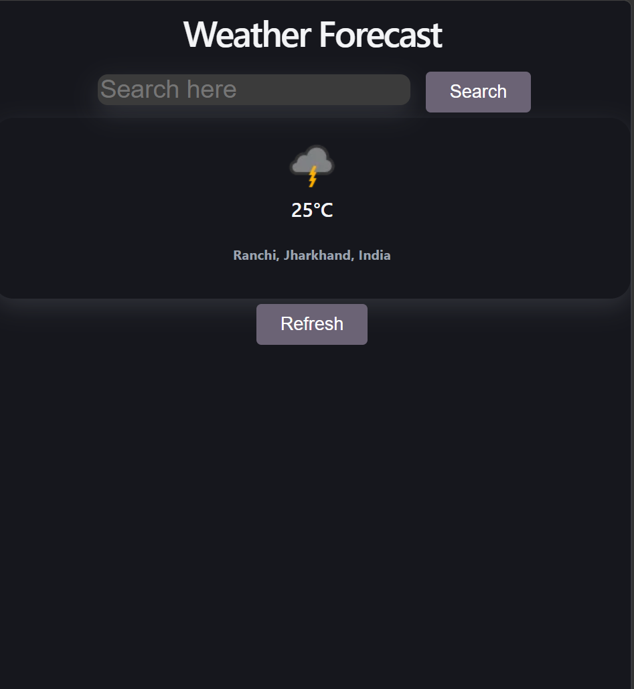

# 🌦️ Weather Forecast App

A simple and responsive Weather App built using **ReactJS** and **Context API**.  
It allows users to search for any city and also fetch weather based on their current location.

---

## 🚀 Features

- 🔍 Search weather by city name  
- 📍 Get weather using current location  
- 🌡️ Real-time temperature display  
- 🌤️ Weather condition icons  
- ⚡ Fast and responsive UI  

---

## 🛠️ Tech Stack

- ReactJS
- Context API
- Fetch API
- WeatherAPI

---

## 📸 App Preview



---

## ⚙️ Setup Instructions

1. Clone the repository:

```bash
git clone https://github.com/General-Radahn-gltich/weather-app.git